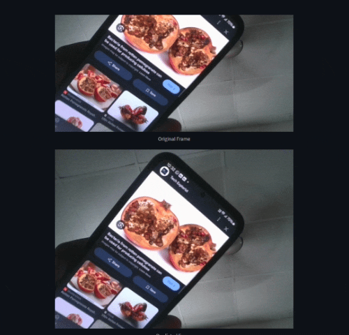

# Multi-Fruit Ripeness Instance Segmentation System

The **Multi-Fruit Ripeness Instance Segmentation System** is a computer vision project designed to identify and classify the ripeness stages of six fruits:  
- **Orange**  
- **Pomegranate**  
- **Banana**  
- **Mango**  
- **Lemon**  
- **Papaya**

<div align="center">
    
    <p><strong>Fruit selection </strong></p>
</div>

Each fruit is annotated with 3-4 ripeness stages and trained using the **YOLOv8l-seg.pt model**, achieving an accuracy of over **90%** for each fruit. The system supports:  
1. **Image Upload**  
2. **Video Upload**  
3. **Real-time Detection** using a webcam.  

<div align="center">
    
    <p><strong>Multiple Selection </strong></p>
</div>

The application is built with **Streamlit**, providing an intuitive user interface for predictions. It displays original and annotated (predicted) outputs side-by-side.

---

## Outputs

<div align="center">
    
    <p><strong>IMAGE PREDICTION </strong></p>
</div>

<div align="center">
    
    <p><strong>REAL TIME RIPE DETECTION</p>
</div>

<div align="center">
    
    <p>REAL TIME UNRIPE DETECTION</p>
</div>

<div align="center">
    
    <p>REAL TIME ROTTEN DETECTION</p>
</div>

---

## Installation

### Download Resources
All required trained model files and additional resources are available in this [Google Drive Link](#).

### Setup Instructions
1. Clone the project repository:
   ```bash
   git clone https://github.com/your-repo/multi-fruit-ripeness-system.git
   cd multi-fruit-ripeness-system
   ```
2.Add Trained Models:

- **Download the trained model files from the provided link and place them in the cloned repository’s folder.**
- **Create a folder named TRAINED_MODEL inside the project folder and place all six trained model files in it.**
```
multi-fruit-ripeness-system/
├── app.py                  
├── TRAINED_MODEL/          
│   ├── ORANGEbest.pt           
│   ├── BANANAbest.pt          
│   ├── POMEGRANATEbest.pt        
│   ├── PAPAbest.pt       
│   ├── MANGObest.pt      
│   └── LEMONbest.pt        
├── requirements.txt        
└── README.md               
```
<div align="center">
    
    <p><strong>FOLDER PATH </strong></p>
</div>

3.Install Dependenceies
```
pip install -r requirements.txt
```
4.Run the Application
```
streamlit run app.py
```
